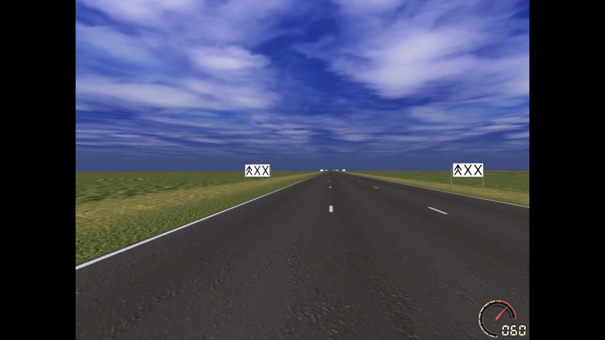
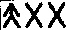

# Sign recognition in driving simulator

-------
### 1. Structure 
##### *(Well documented in each .py file)*
- src
  - - main.py
  - - mySolution1.py
  - - templateMatch.py
- template
- video

----
### 2. Instructions

##### 2.1 Input video
- Put input video(1920*1080) in the folder **video**
- change the variable **videoPath** in the main.py

##### 2.2 Run
- use the configuration in 3.1
- run main.py

##### 2.3 Result
- in the top of the frame, you will see the prediction of the street sign

------
### 3. Workflow
##### 3.1 Main configuration
- Ubuntu 20.04
- Python 3.8.5
- Opencv 4.2.0
- Numpy 1.18.5

##### 3.2 Task
- the location of the **non-x-like** character indicates which lane out of the 3 should the vehicle drive
- There is 3 kind of street sign in both sides of the vehicle, we need to recognize the type of the street sign in real time with **low latency and high accuracy**. And then remind the user of driving simulator to change lane in advance

##### 3.3 Input video
- Frame size: 1920*1080
- initial input image 

##### 3.4 Sliding window
- initial window size 256*256
- example image )

##### 3.5 Find contours
- example image 
- this is relative small with size around 70*40
- 

##### 3.6 Template match and desicion
- in mySolution1.py and templateMatch.py with detailed comments

##### 4 Performance
##### 4.1 Accuracy
- More than 90% in the 10mins test video

##### 4.2 Latency
- around 413 - 5861 microseconds in the 10mins test video
- from one frame is loaded to after processed it ready to do cv2.imshow()

